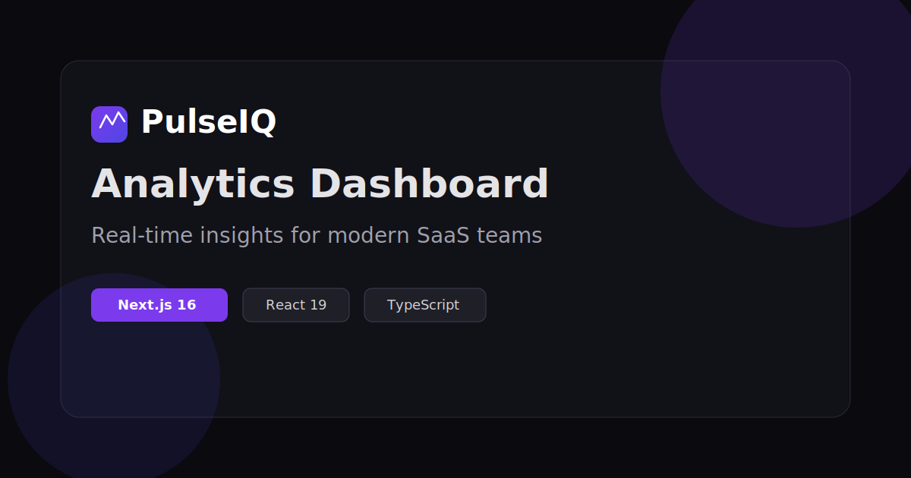

<div align="center">

# PulseIQ

**A polished SaaS analytics dashboard — built as a frontend portfolio project**

[](https://nextjs.org/)
[](https://react.dev/)
[](https://www.typescriptlang.org/)
[](https://tailwindcss.com/)

**[GitHub](https://github.com/whatsgood00/PulseIQ)** · [Report Bug](https://github.com/whatsgood00/PulseIQ/issues)

<br />



</div>

---

## Overview

**PulseIQ** is a modern analytics dashboard UI inspired by enterprise SaaS products like Mixpanel, Amplitude, and Stripe Dashboard. It showcases production-quality frontend patterns — responsive layouts, data visualization, auth flows, and subscription billing — using **mock data** (no backend required).

> This is a **frontend portfolio project**. All API calls are simulated locally for demo purposes.

---

## Features

| Module | Highlights |
|--------|------------|
| **Dashboard** | Revenue, users, conversion & MRR stat cards · Interactive Recharts graphs · Daily / weekly / monthly filters |
| **Auth** | Sign in · Sign up · Forgot password · Toast feedback |
| **Notifications** | Inbox UI · Read / unread states · Type-based icons |
| **Billing** | 3-tier pricing · Monthly / annual toggle · Plan upgrade flow |
| **Settings** | Profile editing · Security section |
| **UX** | Dark & light theme · Framer Motion animations · Glass morphism · Fully responsive |

---

## Tech Stack

- **Framework** — [Next.js 16](https://nextjs.org/) (App Router, Turbopack)
- **UI** — [React 19](https://react.dev/) · [Tailwind CSS 3](https://tailwindcss.com/) · [Framer Motion](https://www.framer.com/motion/)
- **Charts** — [Recharts 3](https://recharts.org/)
- **State** — [Zustand 5](https://zustand-demo.pmnd.rs/) (theme + toasts)
- **Icons** — [Lucide React](https://lucide.dev/)
- **Language** — TypeScript 6 · ESLint 9 (flat config)

---

## Getting Started

### Prerequisites

- Node.js 18.17+
- npm, pnpm, or yarn

### Installation

```bash
# Clone the repository
git clone https://github.com/whatsgood00/PulseIQ.git
cd PulseIQ

# Install dependencies
npm install

# Start development server
npm run dev
```

Open [http://localhost:3000](http://localhost:3000) — landing page with links to the full demo.

### Other Commands

```bash
npm run build   # Production build
npm run start   # Start production server
npm run lint    # Run ESLint
```

---

## Project Structure

```
src/
├── app/                    # Next.js App Router pages
│   ├── dashboard/
│   ├── login/ signup/ forgot-password/
│   ├── notifications/ billing/ settings/
│   └── page.tsx            # Landing page
├── components/
│   ├── charts/             # Recharts wrappers
│   ├── dashboard/          # Stat cards, filters
│   ├── layout/             # Sidebar, auth & dashboard layouts
│   ├── pages/              # Page-level components
│   └── ui/                 # Button, Card, Input, Toast…
├── lib/
│   ├── mock-api.ts         # Simulated REST + GraphQL API
│   └── utils.ts            # Formatters & cn helper
└── stores/                 # Zustand stores
```

---

## Pages

| Route | Description |
|-------|-------------|
| `/` | Landing page with project overview |
| `/dashboard` | Main analytics dashboard |
| `/login` | Sign in (pre-filled demo credentials) |
| `/signup` | Create account flow |
| `/forgot-password` | Password reset flow |
| `/notifications` | Notification inbox |
| `/billing` | Subscription & pricing |
| `/settings` | User profile settings |

**Demo login:** `alex@pulseiq.io` / any password

---

## Design Decisions

- **Mock API layer** — `mock-api.ts` simulates REST and GraphQL with realistic delays, keeping the demo self-contained
- **Theme without flash** — Inline script applies saved theme before first paint
- **Component architecture** — Reusable UI primitives + layout shells + page components
- **English-only UI** — Consistent copy for international portfolio presentation

---

## Production

```bash
npm run build
npm run start
```

Runs the optimized build at [http://localhost:3000](http://localhost:3000).

---

## Portfolio

Copy-ready Upwork portfolio text is available in [`UPWORK.md`](./UPWORK.md).

---

## License

MIT — free to use for learning and portfolio inspiration.

---

<div align="center">

[GitHub](https://github.com/whatsgood00/PulseIQ) · Built with Next.js

</div>
